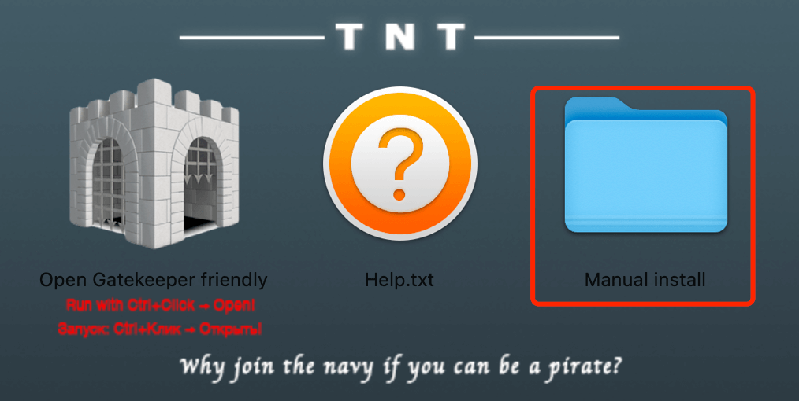
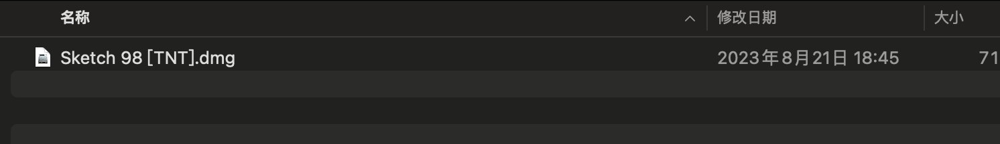
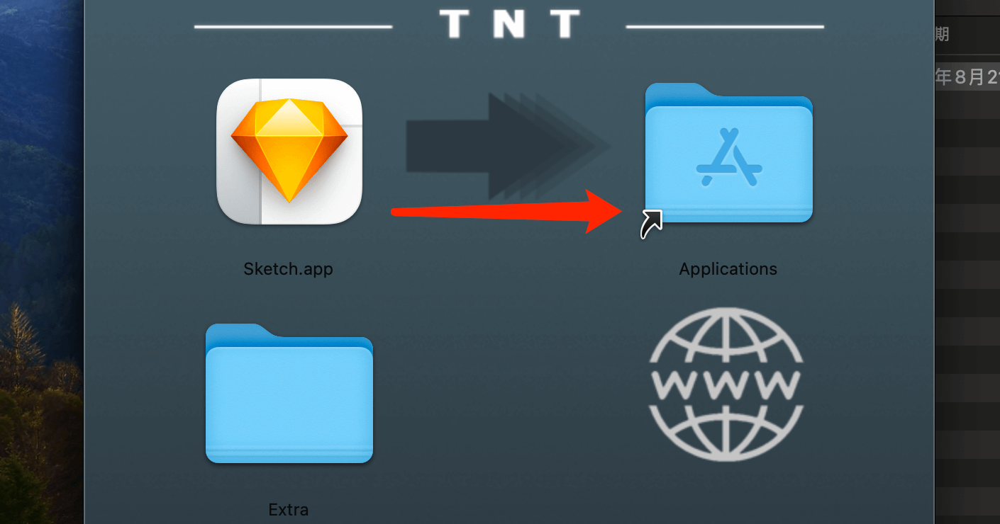
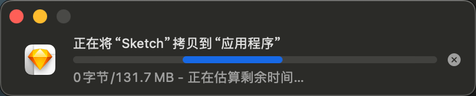
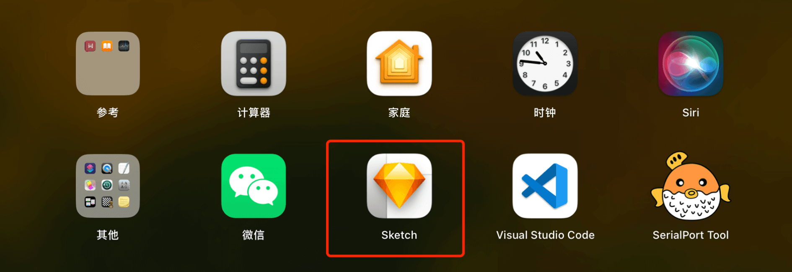
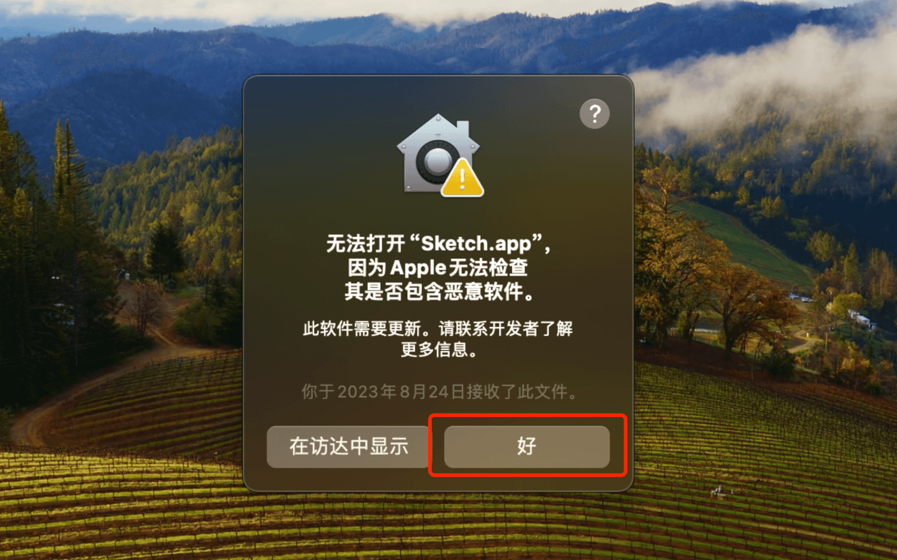
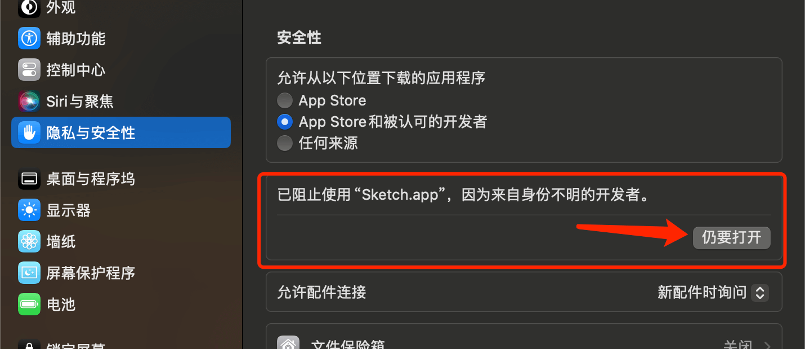
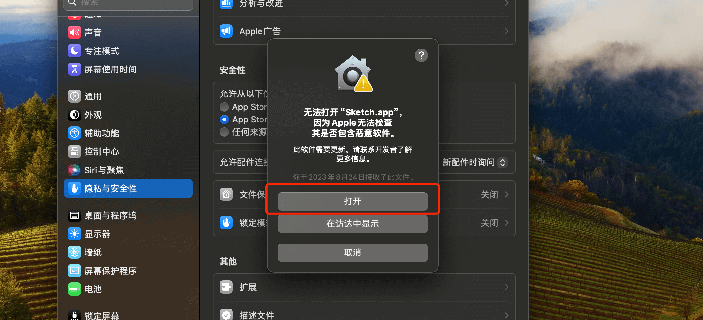
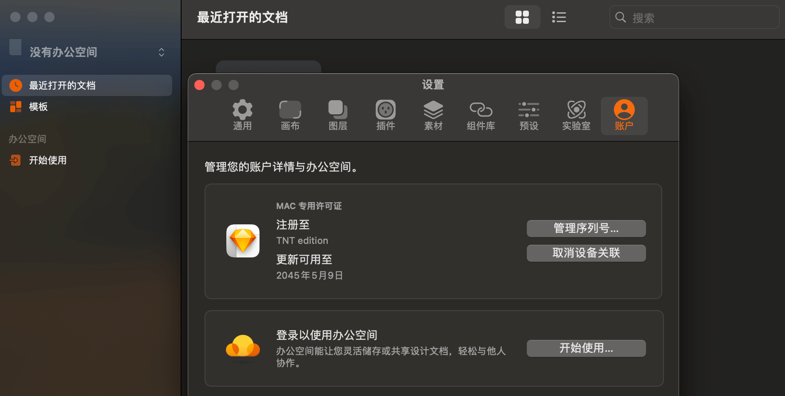

# TNT软件安装教程

## 以下操作以Sketch为例

双击打开`.dmg`安装包，出现如下图所示，再双击进入`Manual install`文件夹

## 安装软件

继续双击打开`.dmg`安装包，打开后，如下图所示，把`Sketch.app`软件拖到`Applications`文件夹。进度条走完后代表软件已经安装成功，可以到启动台中查看。

## 启动软件

启动软件提示，无法打开“xxxx”，因为Apple无法检查其是否包含恶意软件。

解决方法，进去`系统设置`>`隐私与安全性`，滑动右边拖条到最低端，可以看到红框中提示，点击`仍要打开`，此时会弹出软件打开提示，继续点击`打开`即可。

## 查看激活状态

## ADC 资源群

::: tip
扫码添加微信，备注 `ADC` 即可。

:::

