# ParallelsDesktop安装Win10教程

## 添加镜像

进入PD控制中心，添加新镜像。如下图所示。

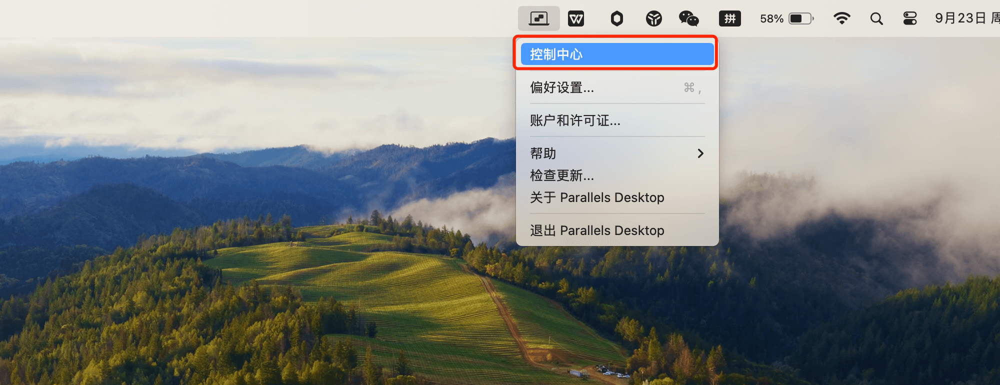

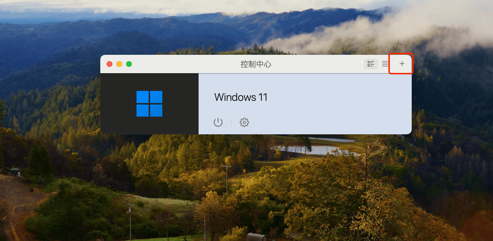

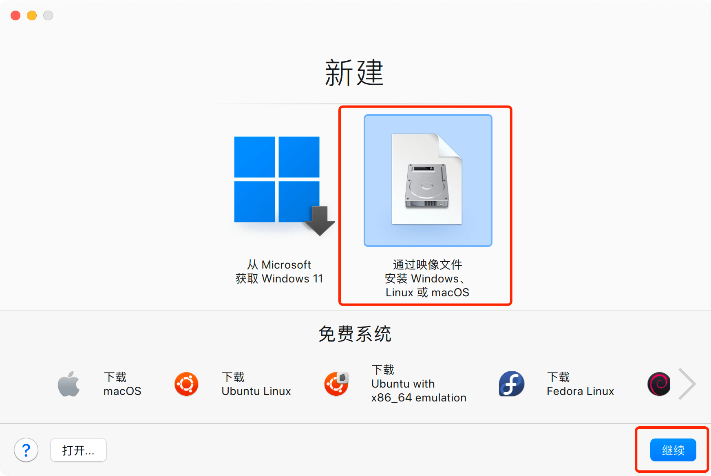

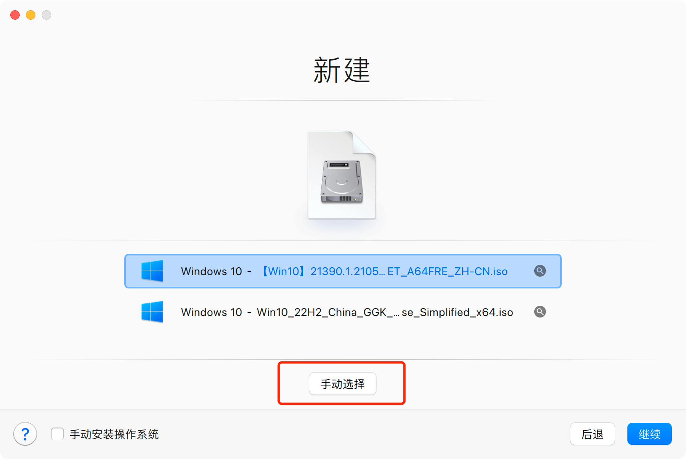

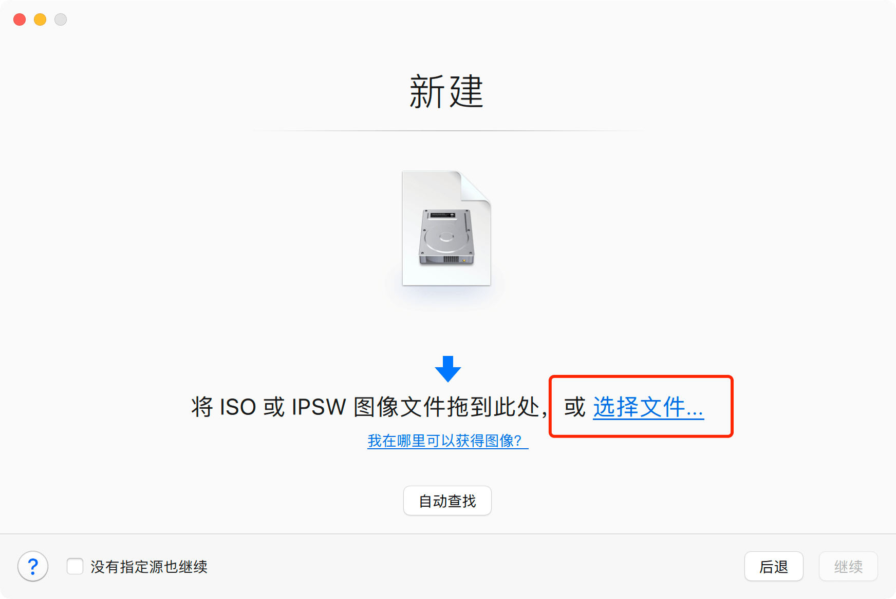

找到下载的win10镜像，再次确认镜像是A64的ISO文件。

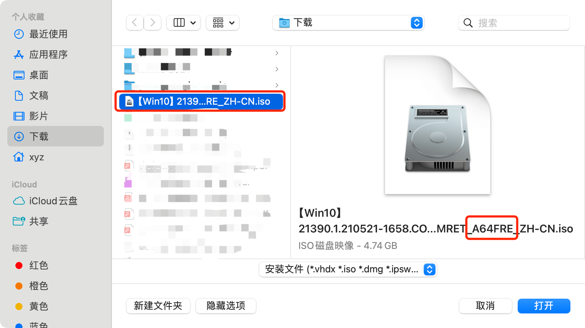

## 配置镜像

打开镜像后，选择版本，按照下图操作，点击完成即可。

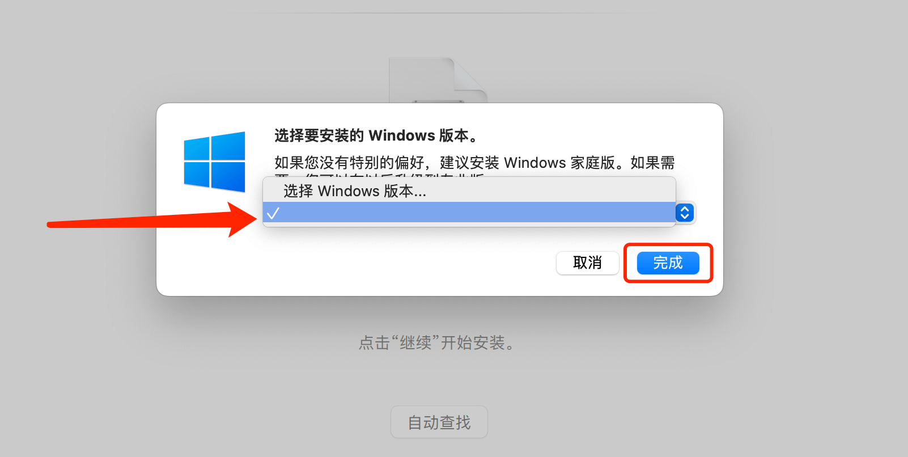

系统名称和保存路径默认即可，并勾选`安装前设定`。

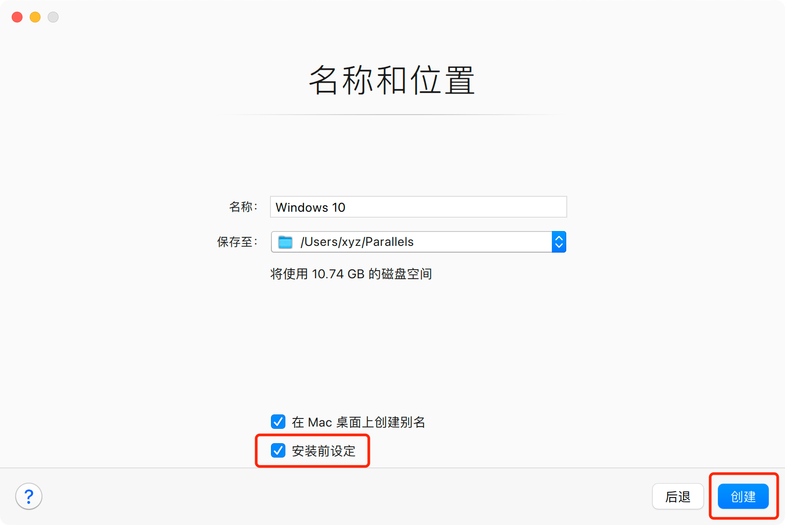

由于PD默认的是win11系统，TPM芯片又是win11必须模块。所以安装win10时需要删掉`TPM芯片`，不然启动win10镜像会自动进入shell界面。

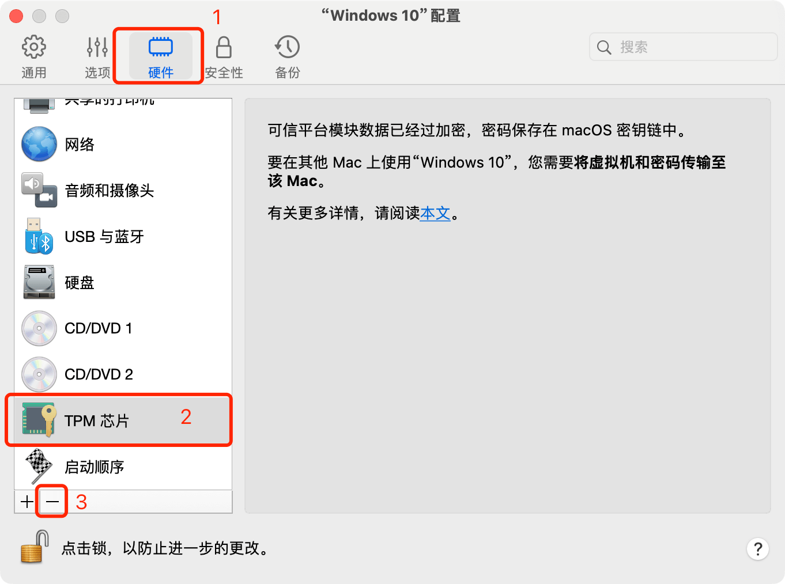

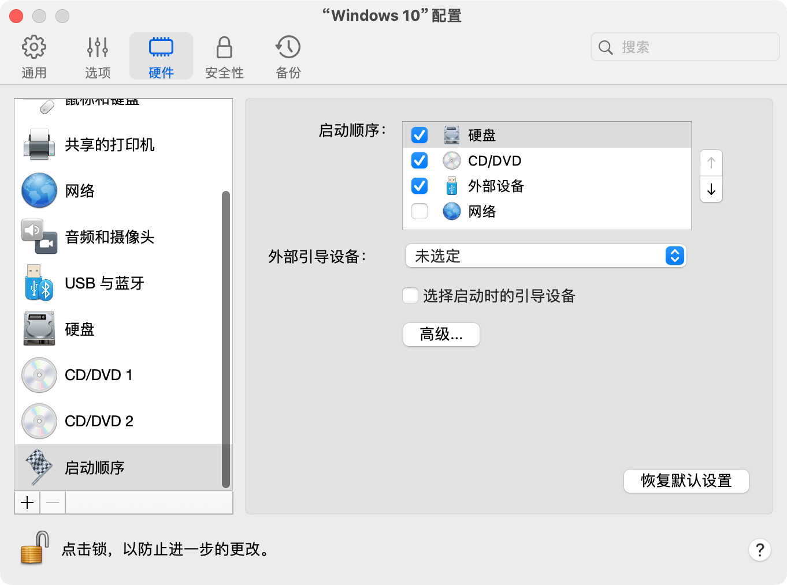

## 启动开机

配置完成后，开始创建系统，win10镜像成功引导开机，等待自动安装进入系统即可。

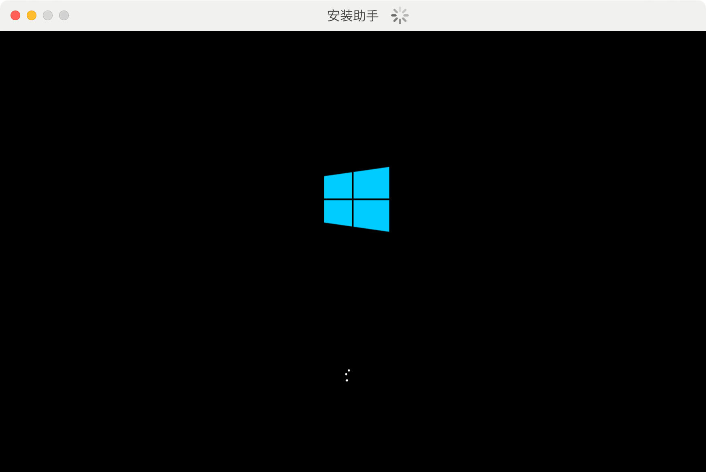

由于ARM版win系统在不断更新中，所以建议按照提示升级为最新版系统。

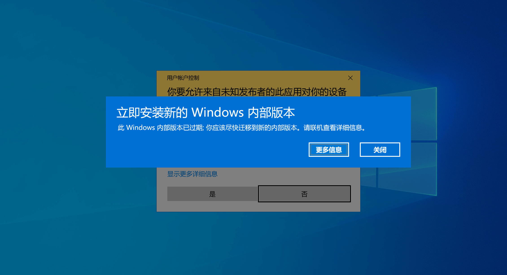

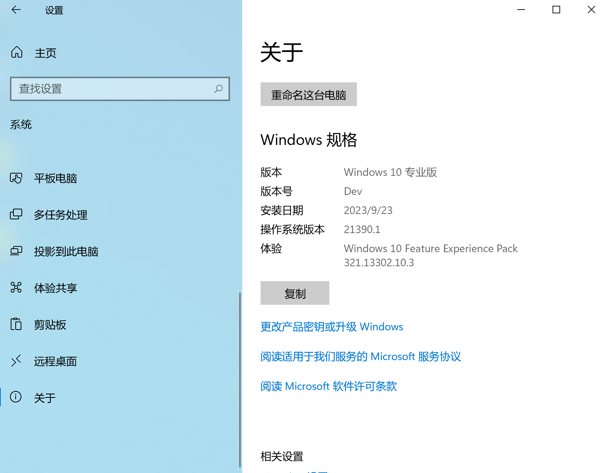

## 配置网络

如果开机之后，系统不能正常上网，安装下图操作即可。

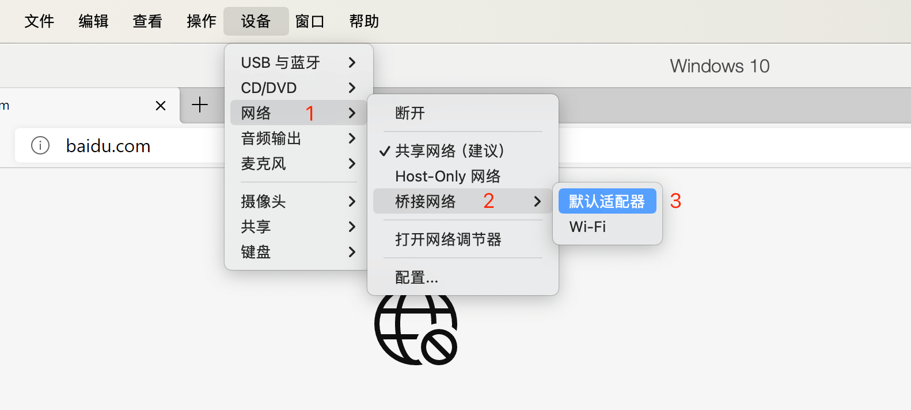

## ADC 资源群

::: tip
扫码添加微信，备注 `ADC` 即可。

:::

