# ParallelsDesktop-18 for Mac 激活教程

Parallels Desktop 18完全支持macOS 13，既可以作为Mac上的主要操作系统，也可以在虚拟机中运行，因此您可以在新操作系统可用时升级Mac计算机。您将在下面看到有关macOS 13具体改进的更多详细信息。

## 安装官方包

使用下载的激活包里面的官方包，或者使用[官方链接](https://download.parallels.com/desktop/v18/18.1.1-53328/ParallelsDesktop-18.1.1-53328.dmg)下载完成安装。

::: tip

以下以激活包为例操作！
:::

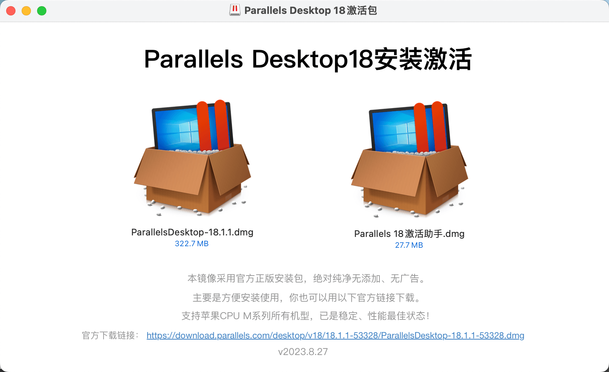

双击对应图标进行安装

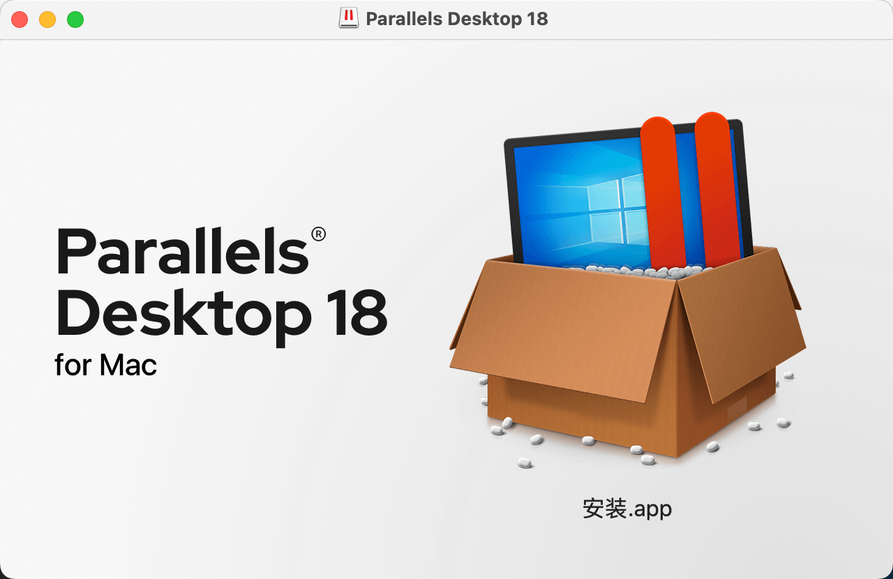

::: warning
关闭忽略版本更新，然后进行完成安装。
:::

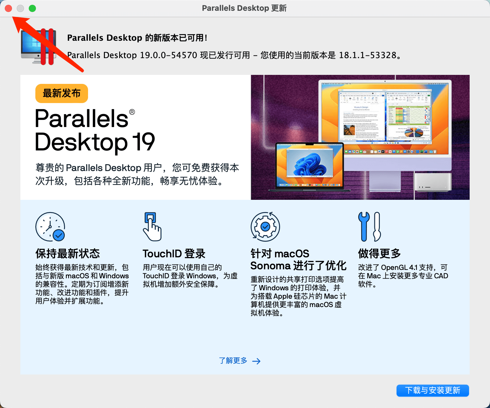

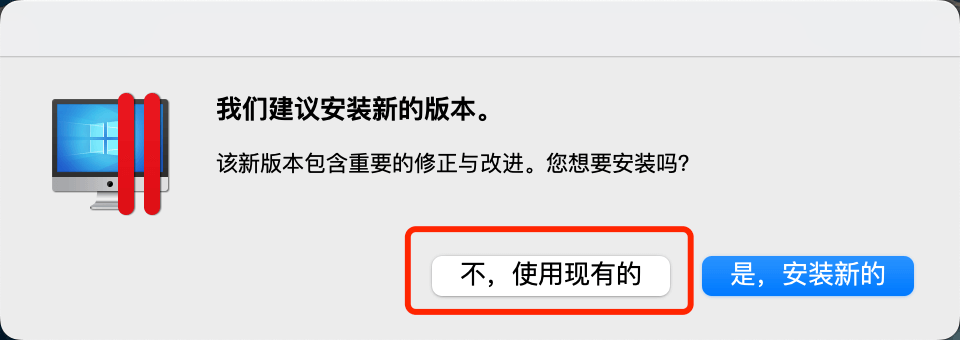

安装完成后，软件处于未激活状态。

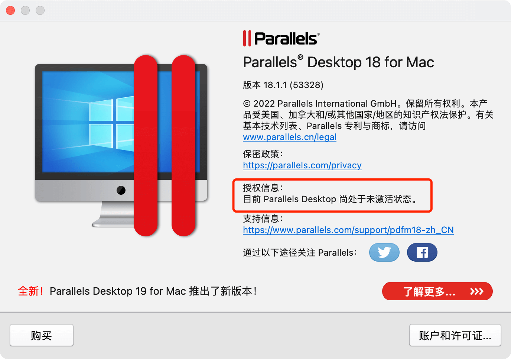

退出刚刚安装完成的软件。

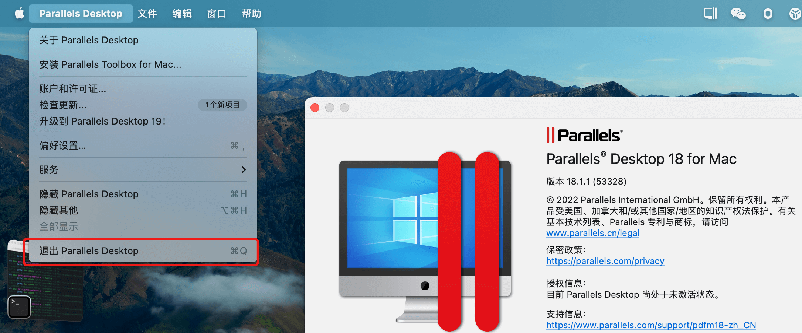

## 激活软件

### App管理添加终端

::: warning
`macOS Ventura 13`及以上版本才需要添加 ！！

低于`macOS Ventura 13`版本的直接跳过到`激活工具`。
:::

在App管理界面，以下是添加之后的界面。如无下图所示；则需按照下图点击➕手动添加即可。

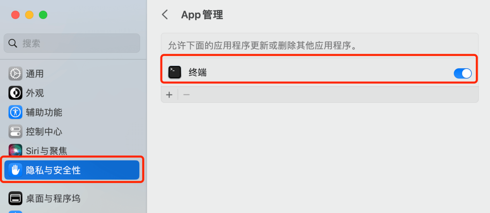

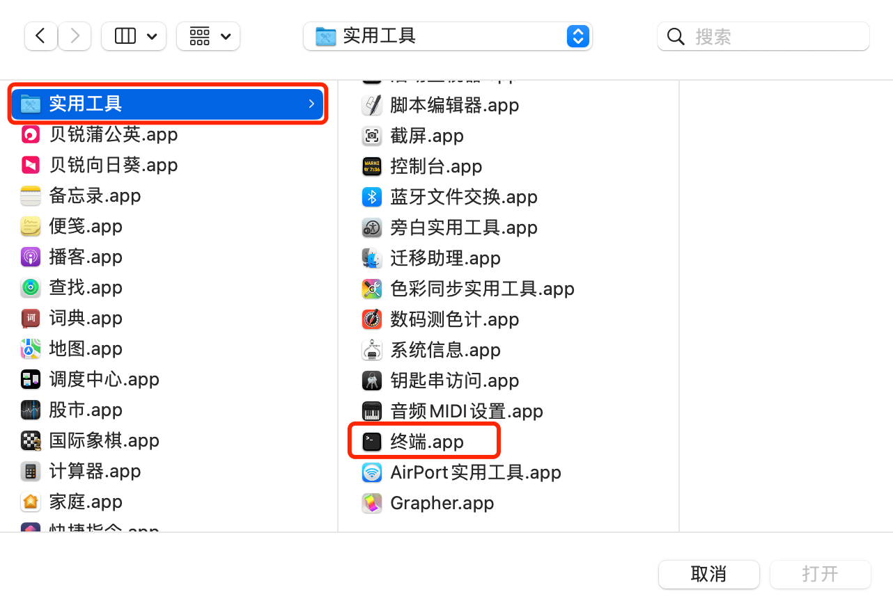

### 开始激活

::: tip

双击`Parallels 18激活助手图标`，打开激活助手。按照图示进行操作即可。
:::

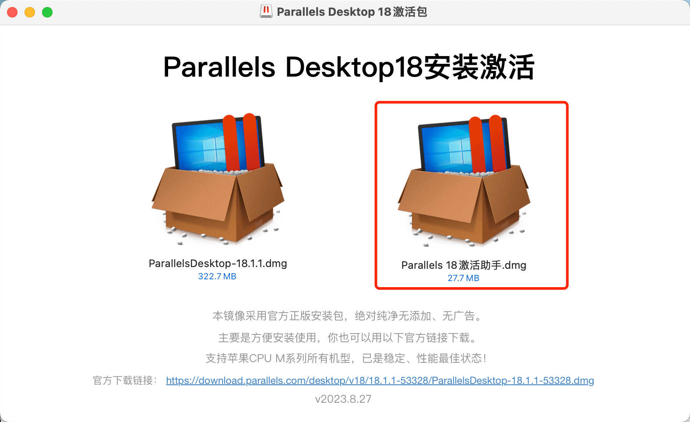

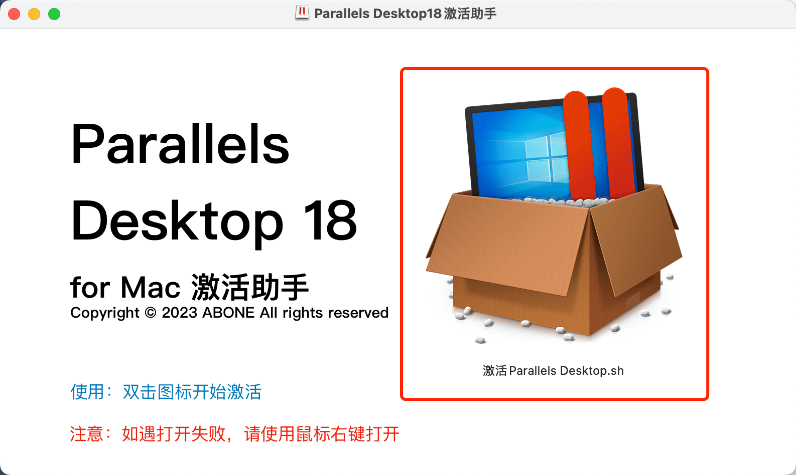
::: tip
密码不可见，输入本机密码后回车。
:::
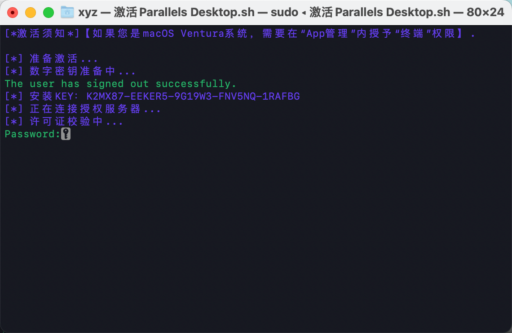

::: tip

如下图所示，已经完成激活操作，可以关闭该窗口。
:::

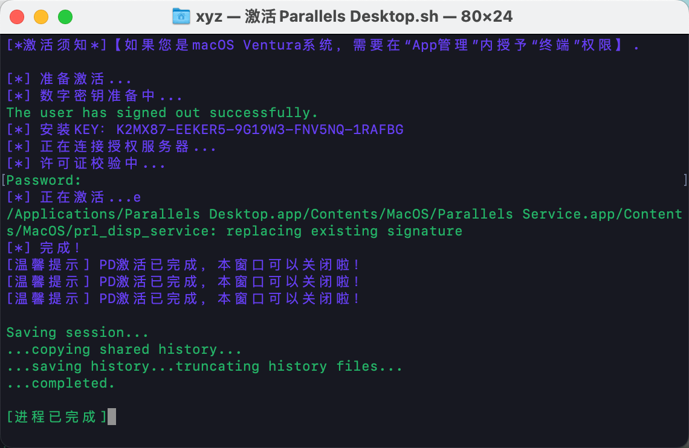

### 查看软件激活状态

启动Parallels Desktop后，右击Parallels Desktop图标 > 关于Parallels Desktop查看激活信息。

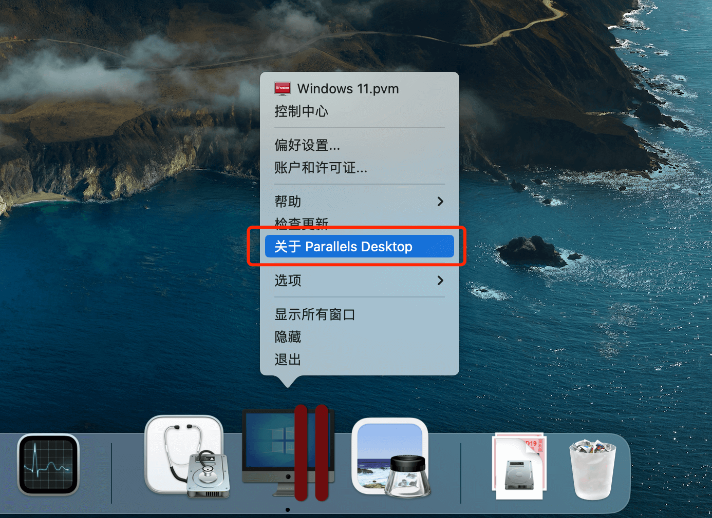

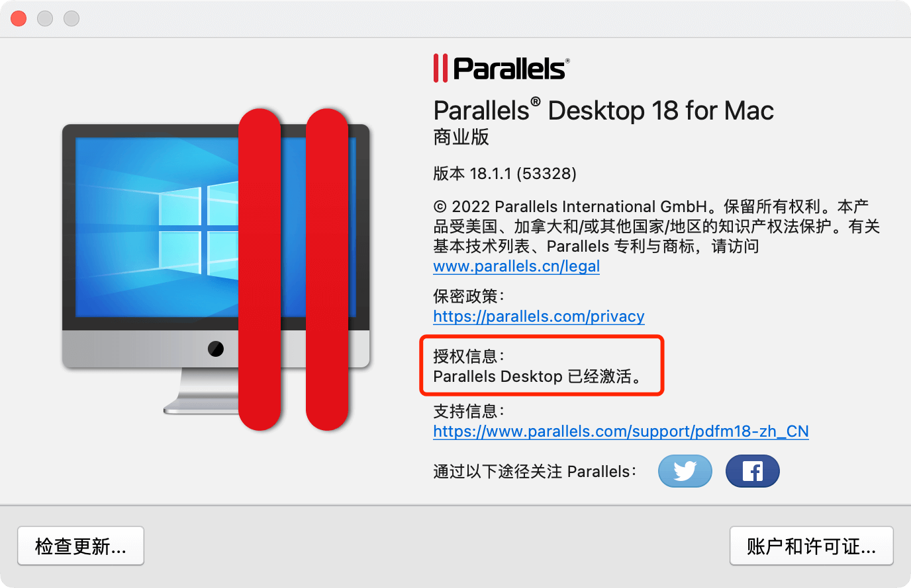

### 修改PD偏好设置

防止软件自动更新

右击Parallels Desktop图标，打开偏好设置，关掉自动更新和检查更新，取消高级选项中的所有勾选。

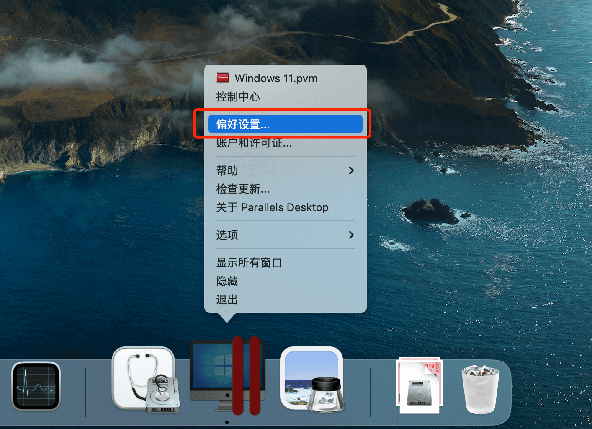

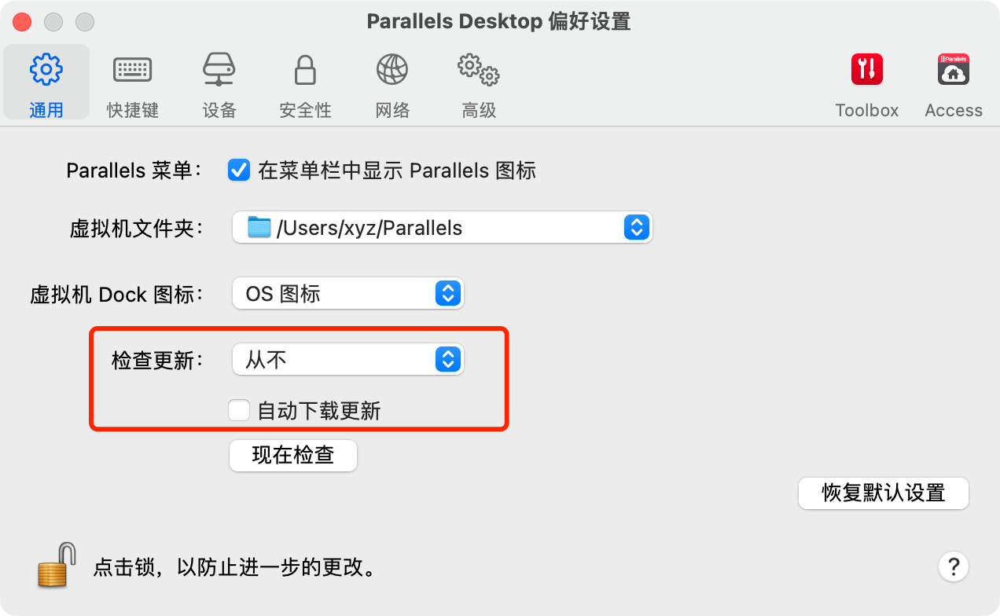

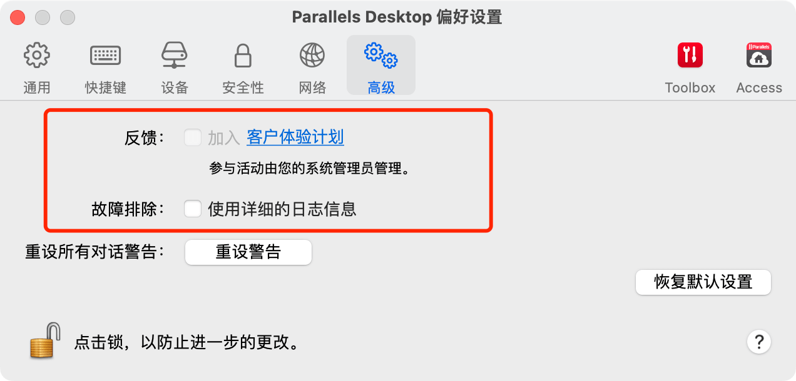

## ADC 资源群

::: tip
扫码添加微信，备注 `ADC` 即可。

:::

