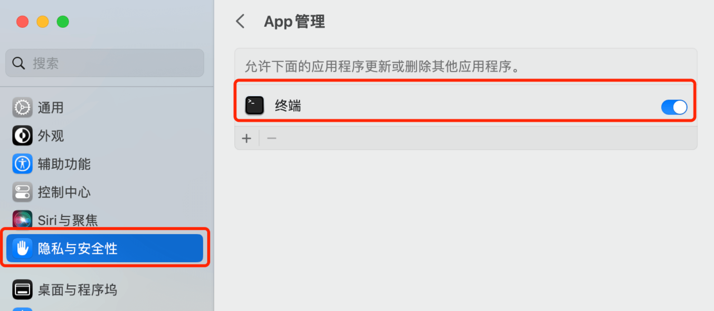
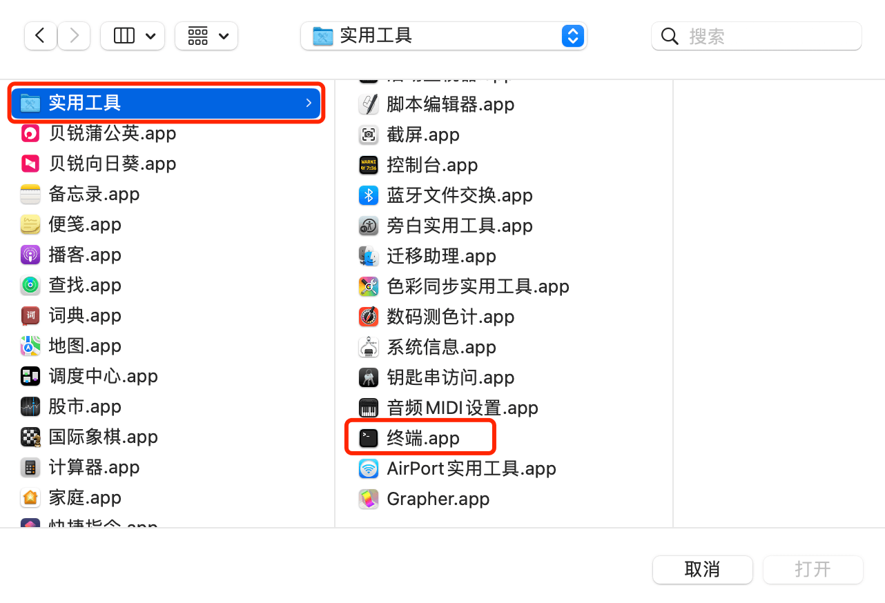

# ParallelsDesktop-19 for Mac 激活教程

Parallels Desktop 19完全支持macOS Sonoma 14，既可以作为Mac上的主要操作系统，也可以在虚拟机中运行，因此您可以在新操作系统可用时升级Mac计算机。您将在下面看到有关macOS Sonoma具体改进的更多详细信息。

## 安装官方包

### 👉 [点击下载官方包](https://download.parallels.com/desktop/v19/19.1.0-54729/ParallelsDesktop-19.1.0-54729.dmg) 👈

双击打开安装包`ParallelsDesktop-19.0.0-54570.dmg`，再双击红框图标，开始安装，等待安装完成即可。

安装完成后，软件处于未激活状态。

## 开始激活

### App管理添加终端

::: warning
`macOS Ventura 13`及以上版本才需要添加 ！！

低于`macOS Ventura 13`版本的直接跳过到`激活工具`。
:::

在App管理界面，以下是添加之后的界面。如无下图所示；则需按照下图点击➕手动添加即可。

### 激活工具

双击打开激活包`Parallels 19激活助手.dmg`，继续双击红框图标开始激活。

::: warning
第一次使用软件，可能出现以下提示情况。原因是由于软件不在App Store下载导致。

提示，无法打开“xxxx”,因为Apple无法检查其是否包含恶意软件
点击这里👉  [解决无法打开-xxxx-因为apple无法检查其是否包含恶意软件](新手MAC安装常见问题.md#解决无法打开-xxxx-因为apple无法检查其是否包含恶意软件。)

操作完成后，刚才运行的软件需要重新双击打开
:::

打开激活工具后，此时的状态是未安装，点击下面红框`安装补丁/Install`即可。

如下图所示，表示已经激活成功，

### 启动软件

::: warning
激活之后，第一次打开软件会出现以下提示，点击`取消`即可。

解决方法：按照以下截图步骤操作

1、点击访达

2、点击应用程序，找到`Parallels Desktop.app`，右击`打开`就能正常使用软件。

3、操作之后，正常启动即可，不会再提示报错信息。

:::

### 查看软件激活状态

右击Parallels Desktop图标，关于Parallels Desktop查看激活信息。

如下图所示，现已激活成功。

### 修改PD偏好设置

防止软件自动更新

右击Parallels Desktop图标，打开偏好设置，关掉自动更新和检查更新，取消高级选项中的所有勾选。

## DP19更新日志

### 新增功能

- 为macOS Sonoma 14做好准备

Parallels Desktop 19完全支持macOS Sonoma 14，既可以作为Mac上的主要操作系统，也可以在虚拟机中运行，因此您可以在新操作系统可用时升级Mac计算机。您将在下面看到有关macOS Sonoma具体改进的更多详细信息。

- 外观和感觉

添加反映最新设计准则的新应用程序图标；

添加了重新设计的对话框和警报，以便更容易地与应用程序交互；

在打开存档和打包的虚拟机之前添加确认对话框；

恢复到快照时，在警告对话框中添加“不再显示”复选框。

- Mac上的Windows

与Mac集成：允许使用Mac的Touch ID登录到Windows 10或Windows 11虚拟机。您的Windows帐户凭据安全存储在macOS钥匙链中，受Touch ID保护，仅在此Mac上可用。

图形：在Windows中添加了对OpenGL 4.1版本的支持，使您能够运行ArcGIS CityEngine 2023、Vectorworks Vision 2023、VariCAD、Deswik.CAD等。此版本还提高了ArcGIS Pro软件的性能。

打印：在macOS Sonoma上，Parallels Desktop 19现在使用Internet打印协议（IPP）从Windows进行打印，该协议与硬件支持的功能具有更好的兼容性。

键盘：在Microsoft Edge中，Command+W现在关闭一个选项卡，而不是退出应用程序。

**Linux**

增加了对几个最新Linux发行版的支持，包括Ubuntu 22.04.2、Fedora 38、Debian 12、CentOS 9等；

支持在带有Apple Silicon的Mac计算机上安装和运行Arm版本的CentOS 9 Stream。

**macOS（作为虚拟机）**

增加了在苹果硅上暂停和恢复macOS虚拟机的功能；

在macOS Ventura 13及更新版本上，添加了使用“新建”对话框从IPSW映像在苹果硅Mac上安装macOS虚拟机的功能；

在macOS Ventura 13及更新版本上，增加了对“滚动和缩放”多点触摸手势的支持；

在macOS Sonoma 14及更新版本上，支持基于虚拟机窗口大小的动态虚拟机分辨率调整。

### 停用功能

从Parallels Desktop 19中删除了什么

根据参与Parallels客户体验计划的用户的统计，一些产品功能很少使用或根本没有使用。我们决定要么停止支持并从Parallels Desktop中删除它们，要么专注于常用功能和进一步的增强。

- macOS 10.14、10.15和11（作为主操作系统）将无法运行Parallels Desktop 19。作为用户，您仍然可以在这些macOS系统上使用以前版本的Parallels Desktop，甚至可以使用Parallels Desktop19许可证密钥激活它；
- 在使用英特尔处理器的Mac电脑上，不再支持旧的Windows操作系统版本（2000、XP、Vista、8和8.1）。作为用户，您仍然可以安装或使用它们，但它们不再得到维护。Parallels建议升级到最新版本；
- “打印为PDF（Mac Desktop）”打印选项不再可用。使用微软的“打印成PDF”；
- 在使用英特尔处理器的Mac电脑上，“从电脑传输Windows”选项不再可用。使用Apple迁移助手在新的Windows虚拟机中手动迁移数据和重新安装Windows应用程序；
- 带有检查频率选择器的“检查更新”下拉菜单不再可用。如果启用了自动检查，Parallels Desktop在运行时每天检查一次更新。

## ADC 资源群

::: tip
扫码添加微信，备注 `ADC` 即可。

:::

