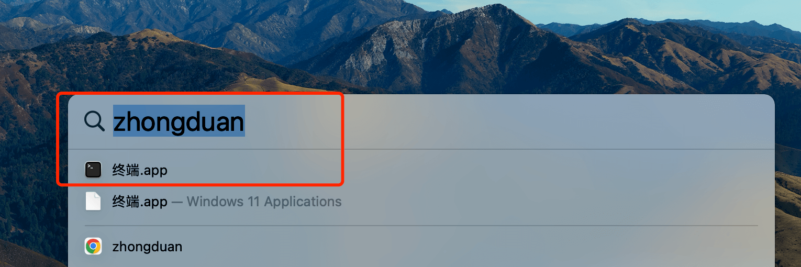
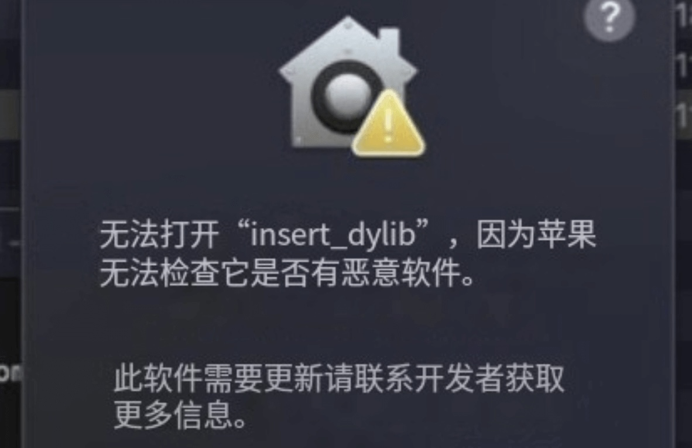
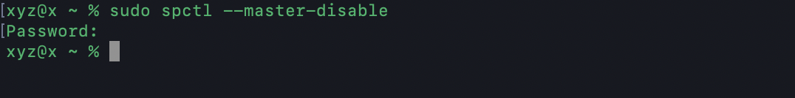
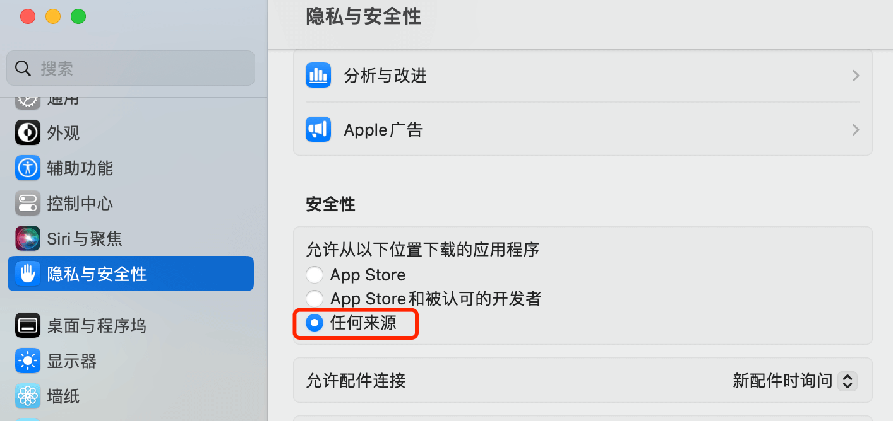
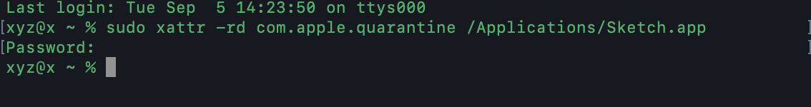

# 新手MAC安装常见问题

## 打开终端

::: tip
打开方式：`command`+空格，输入`终端`或者`zhongduan`，如下图，打开终端
:::




## 解决无法打开“xxx”，因为Apple无法检查其是否包含恶意软件。




输入以下命令回车，再输入本机密码回车（密码不可见

```sh
sudo spctl --master-disable
```




操作完成后，在系统设置 > 隐私与安全性界面，如下图所示：




## 解决“xxx”,已损坏，无法打开。您应该将它移到废纸篓。

输入以下命令回车，再输入本机密码回车（密码不可见

::: warning

`xxx`是软件名

:::

```sh
sudo xattr -rd com.apple.quarantine /Applications/xxx.app
```

以下命令是以`Sketch`为例，操作完成后，重新打开软件即可。




## ADC 资源群

::: tip
扫码添加微信，备注 `ADC` 即可。

:::

