# 广东电信天翼网关开启IPV6

## 1.修改天翼网关

::: tip

- 地址：`http://192.168.1.1`

- 用户名：`telecomadmin`

- 密码：`nE7jA%5m`

:::

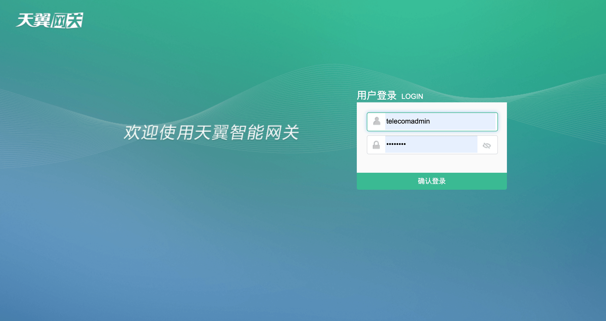

### 1.1.获取PPPoE账号与密码

点击网络，网络连接 > 宽带设置界面如下

连接名称选择`3_INTERNET_B_VID_41`，可以看到用户名与密码，此时密码是不可见。

::: tip
通过Chrome查看

- 按F12进入开发者模式 > 元素
- 点击`红框内箭头`，再去点击宽带密码框，可以看到`type="password"`，如下图
- 把`password`，改成`text`，如下图，此时密码可见
- 把用户名，密码复制出来备用。
:::

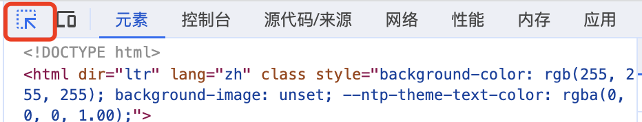

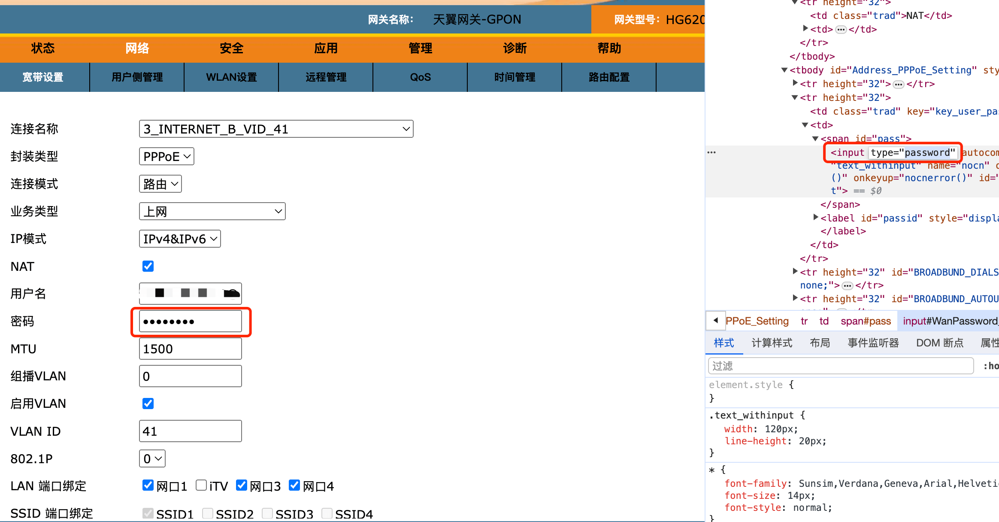

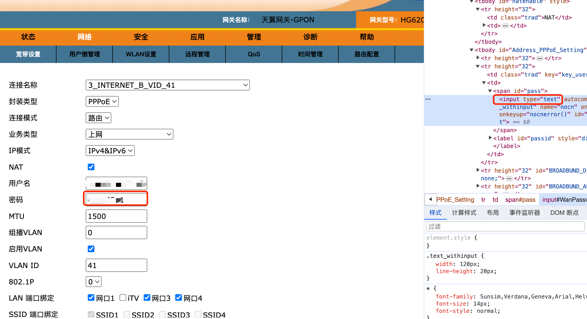

### 1.2.上网参数设置

- 连接名称：`3_INTERNET_B_VID_41`
- 封装类型：`PPPoE`
- 连接模式：`桥接`
- 业务上网：`上网`
- IP模式：`IPv4&IPv6`
- 设置完成后如下图，按照设置即可

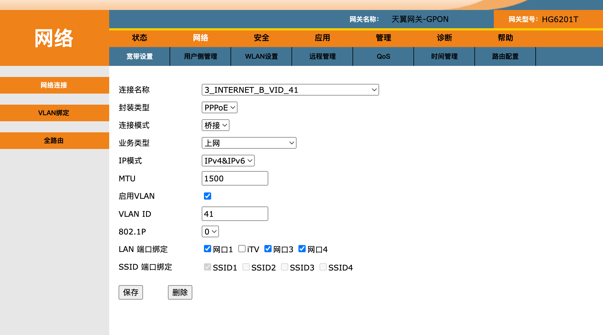

### 1.3.IPTV参数设置

- 连接名称：`2_Other_B_VID_45`
- 封装类型：`PPPoE`
- 连接模式：`桥接`
- 业务上网：`其他`
- IP模式：`IPv4&IPv6`
- 设置完成后如下图，按照设置即可

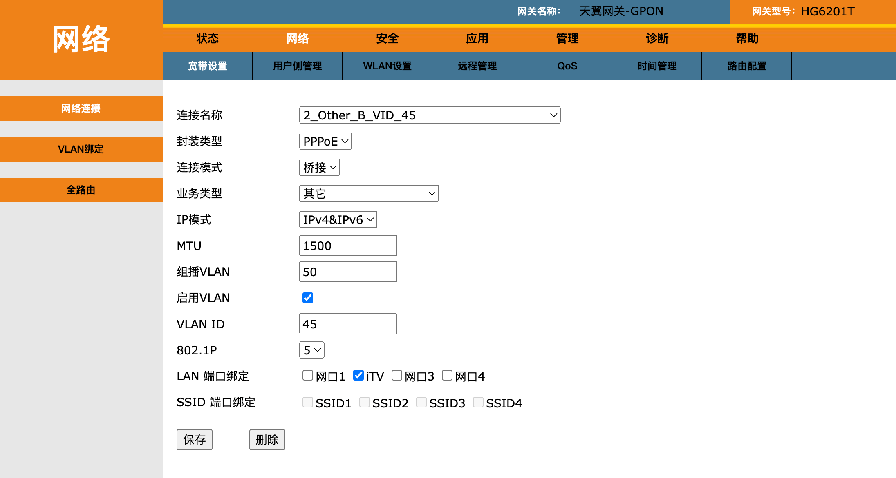

### 1.4.查看连接状态

点击`状态` > 状态纵览，如下图，业务状态应为可用。

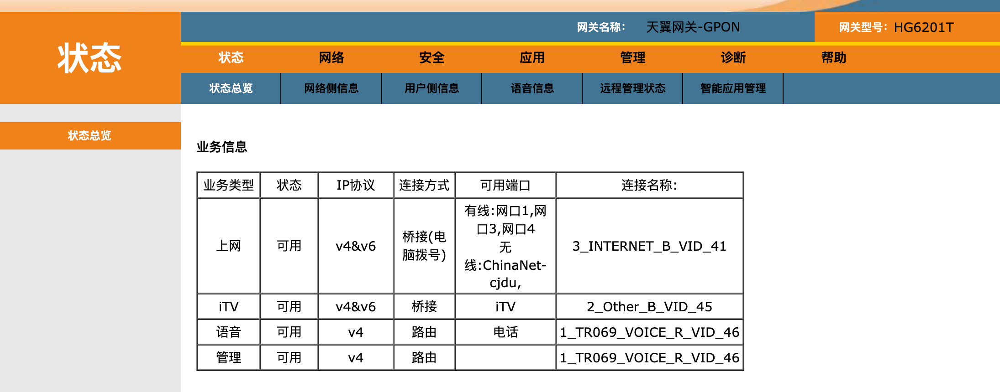

## 2.修改路由器（小米路由器

### 2.1.上网设置，PPPoE拨号

- 上网方式： `PPPoE`
- 账号：`在天翼网关复制的账号`
- 密码：`在天翼网关复制的密码`
- 设置完成后，如下图
- 然后点击 **应用**

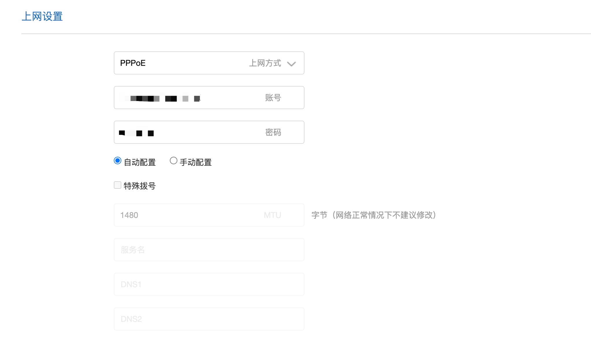

### 2.2.IPV6网络设置

打开`IPV6网络设置开关`

- 上网方式：`Native`
- 手动配置DNS：广东地区是 `240e:1f:1::1` 和 `240e:1f:1::33`
- 更多DNS查看： [IPv6 DNS 地址列表新窗口打开](https://ipw.cn/doc/ipv6/user/ipv6_dns.html)
- 设置完成后，如下图
- 然后点击 **应用**

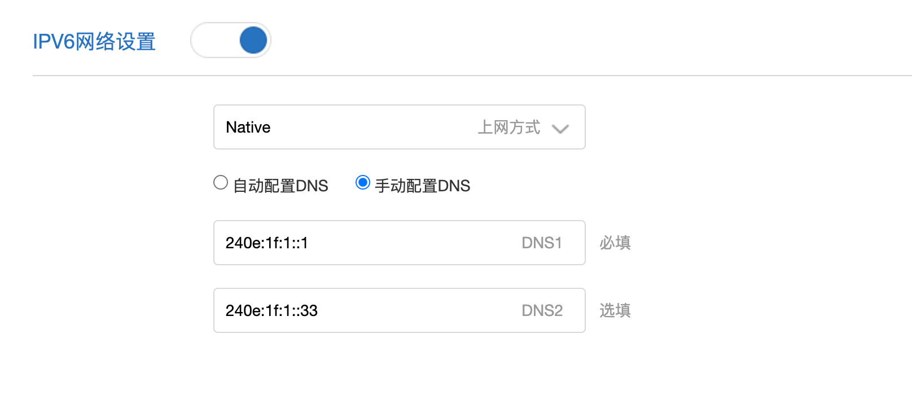

### 2.3.查看上网信息

如下图，路由通过PPPoE实现拨号上网，IPV6地址均完成分配。

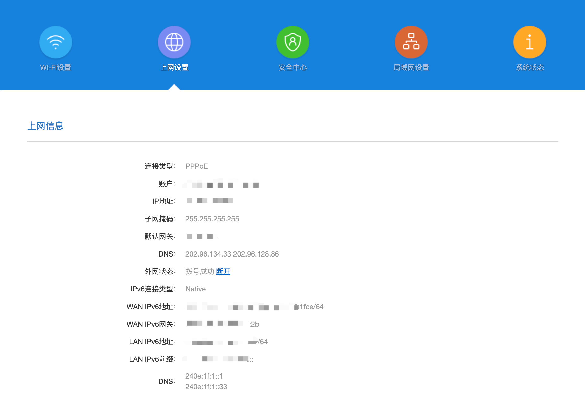

### 2.4.验证IPV6连接状态

[点击测试IPV6状态](https://ipw.cn)，如下图表示IPV6已经启用成功。如获取IPV6失败，请重启`天翼网关`和`路由器`。

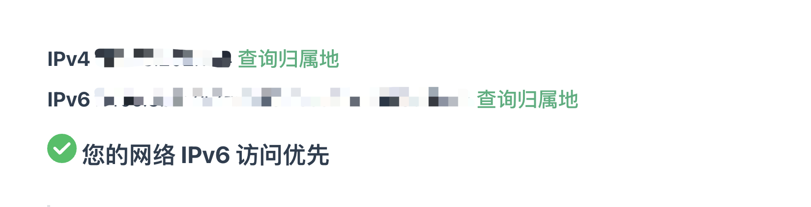

## ADC 资源群

::: tip
扫码添加微信，备注 `ADC` 即可。

:::

