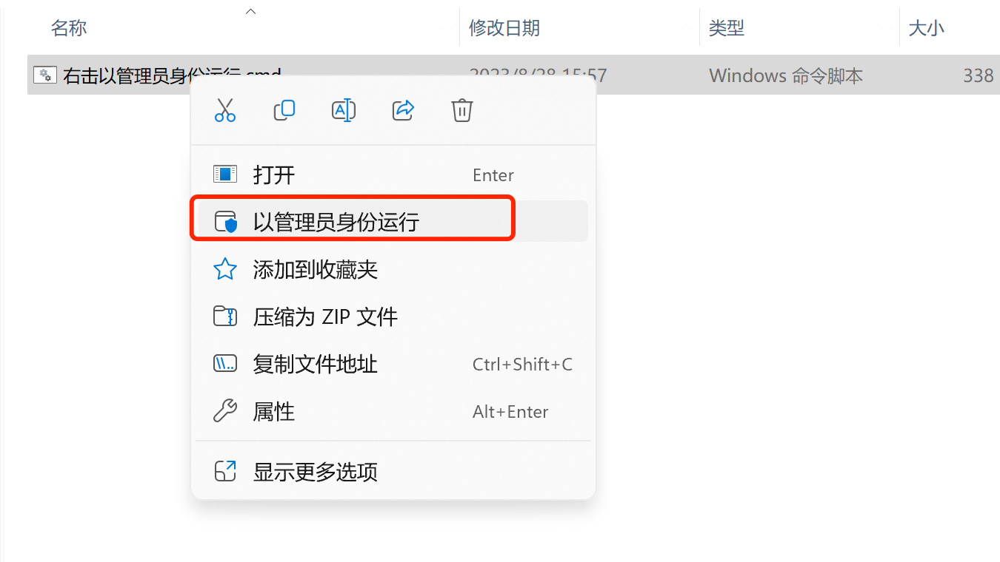
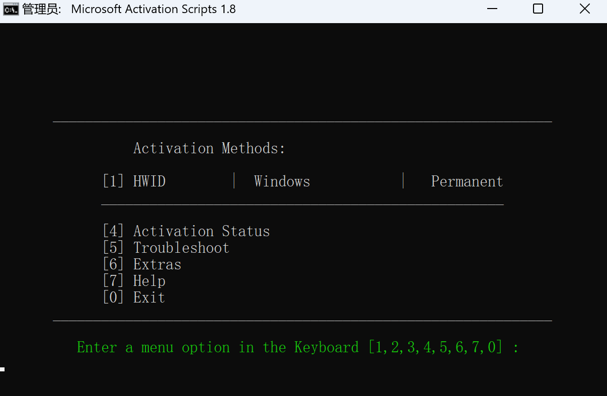
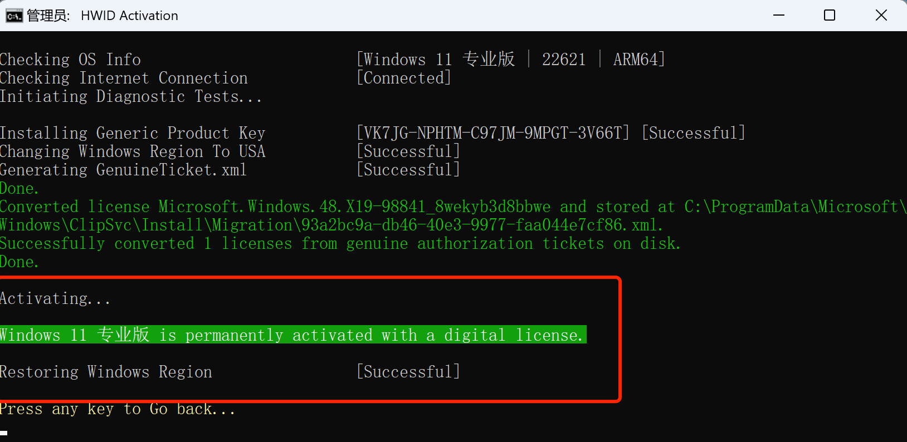
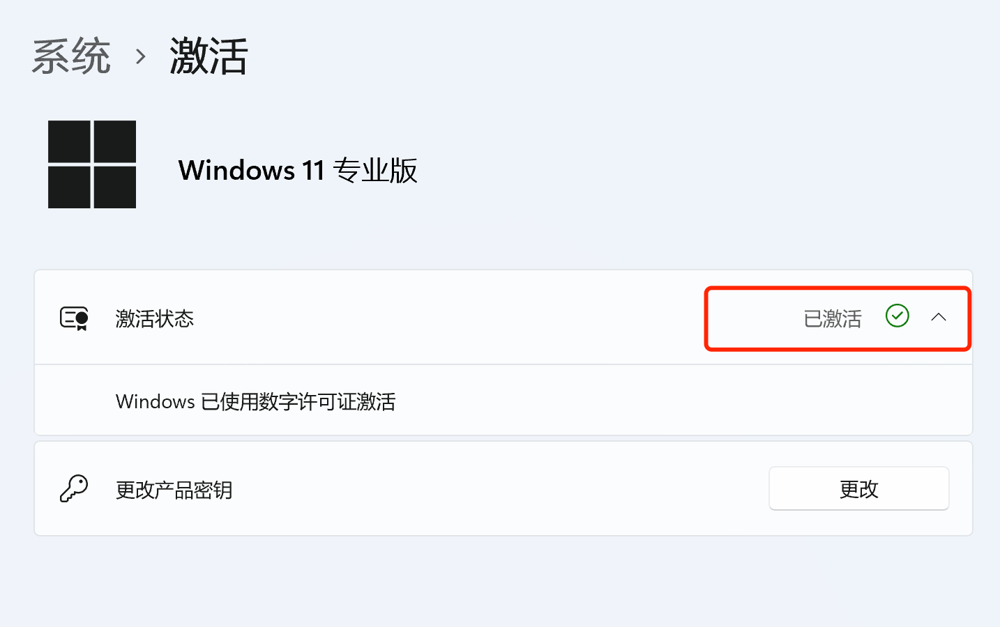

# 永久激活win10-11专业版教程

## 开始前准备
::: warning
激活开始之前，要确保windows处于正常上网状态
:::

## 开始激活

右击以管理员身份运行激活工具

运行成功后出现以下界面，输入数字`1`，自动开始激活动作。

等待大概10秒左右，出现以下界面代表激活成功。然后关闭该窗口

## 查看激活状态
进入设置>系统>激活界面，查看激活状态，如下图所示。

## ADC 资源群

::: tip
扫码添加微信，备注 `ADC` 即可。

:::

